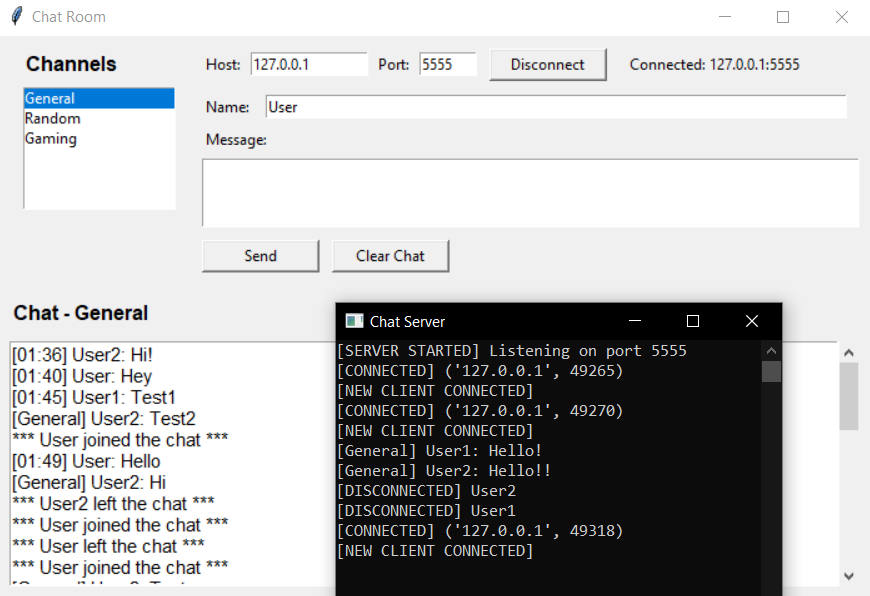

# CHAT ROOM v2.0

Chat room app written in Python with persistent chats via JSON serialization.

chat_app/\
├── READ ME.txt\
├── cert.pem\
├── client.py\
├── data/\
│   ├── Gaming.json\
│   ├── General.json\
│   └── Random.json\
├── generate_cert.py\
├── key.pem\
├── lib/\
│   └── venv/\
├── run.bat	# Run this to start\
└── server.py

